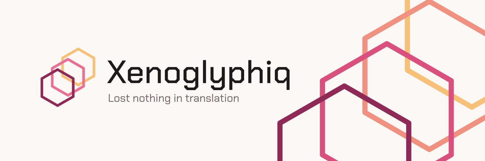
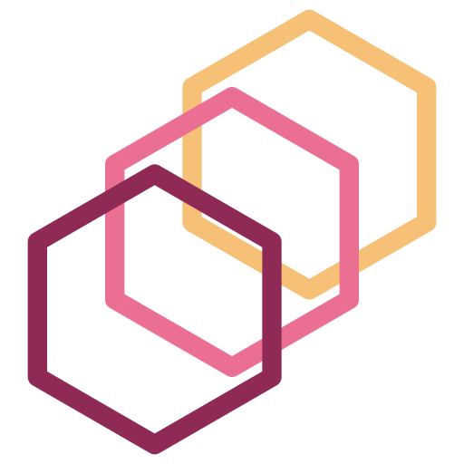
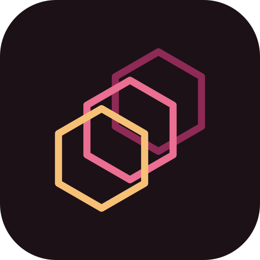
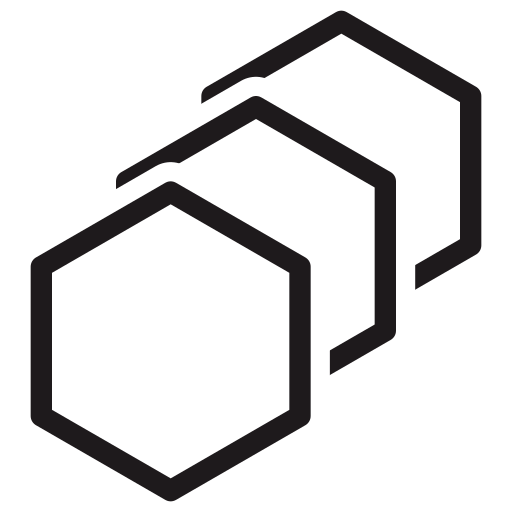
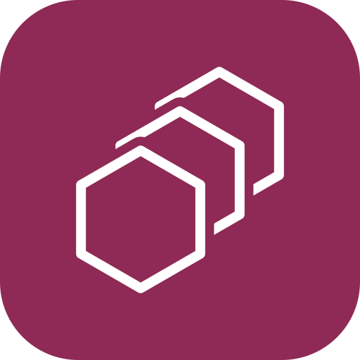

# Xenoglyphiq brand guide

<picture>
  <source media="(prefers-color-scheme: dark)" srcset="brand/banners/png/github-banner-dark.png">
  
</picture>

**Xenoglyphiq** is a home for ports of libraries into Swift, Go, Nim, Zig, and sometimes Rust.

- *Xeno* means foreign and *glyph* means a written character: the same thing, written in
  another script. The *-iq* ending is part of the name; always spell it with a *q*.
- **Tagline:** *Lost nothing in translation.* Write it in sentence case, with no
  trailing period on banners.

Every asset in `brand/` is generated from [`brand/tokens.json`](brand/tokens.json) by
[`brand/build.py`](brand/build.py). To change something, change the tokens and rebuild.
Don't hand-edit the outputs.

---

## The mark

 &nbsp;

One hexagon, repeated three times on a diagonal, each copy shifted a little. It's the same
thing in a slightly different place, which is what a port is.

### Construction (mark units)

| | Value |
|---|---|
| Shape | Regular hexagon, pointy-top |
| Radius (center to corner) | 28 |
| Copies | 3 |
| Step between copies | 16 right and 16 up per copy (0.571 × radius) |
| Stroke | 4, round joins |
| Artboard | 96 × 96, centered on the middle hex |

The back copies sit up and to the right, and the front copy sits down and to the left.

### Color order (the one rule to remember)

| Background | Back → front | Why |
|---|---|---|
| Light | amber → rose → **wine** | The darkest copy is in front. |
| Dark | wine → rose → **amber** | The order flips, so the brightest copy is in front. |

**Never** put the light-background version on a dark background. The wine front copy
disappears there.

### One-color versions

When the mark is a single color (ink, white, a knockout tile), each hex hides everything
behind it, with a small gap. This keeps the stack readable as layers without color. The
gap is 0.9 × stroke, and the build handles it, so don't redraw it by hand.

 &nbsp;

### Small sizes

| Rendered size | Cut | What changes |
|---|---|---|
| Above 64 px | Standard | — |
| 25–64 px | Small | Stroke 7, radius 26, step 14 |
| 24 px and below | Tiny | **Two** hexes (the front pair), stroke 10, radius 30, step 18 |

Three outlines blur together at favicon size, so the tiny cut drops the back copy.

### More hexes: large surfaces only

The mark is always **three** hexes. Banners, social images, and hero art may extend the
chain to four, five, or more:

- Keep the same spacing ratio as the mark (step = 0.571 × radius).
- Use a lighter display stroke (0.07 × radius).
- Use the same color order rule: light backgrounds end on wine, dark backgrounds end on
  amber.
- Use extended chains only where the art is at least banner-sized. Never use them in the
  logo itself, the avatar, or favicons.

Four-hex chains use the palette's in-between steps. Five or more interpolate from amber
through rose to wine.

---

## Color: Ember

| Token | Hex | Use |
|---|---|---|
| amber | `#F6C177` | Back copy on light, front copy on dark |
| rose | `#EB6F92` | Middle copy |
| wine | `#8E2A55` | Front copy on light, back copy on dark, knockout tile |
| ember 4-step | `#F6C177` `#F0907F` `#D9507F` `#8E2A55` | Four-hex display chains |
| ink | `#1E1A1C` | Wordmark on light |
| ink soft | `#6B5F64` | Tagline on light |
| paper | `#FAF7F5` | Light background |
| night | `#1C1117` | Dark background |
| on night | `#F7EDEF` | Wordmark on dark |
| on night soft | `#C9A9B6` | Tagline on dark |

Flat color only: no gradients, glows, or drop shadows on the mark.

---

## Type: Chakra Petch

| Use | Weight | File |
|---|---|---|
| Wordmark | Medium 500 | `brand/fonts/ChakraPetch-Medium.ttf` |
| Tagline, body | Regular 400 | `brand/fonts/ChakraPetch-Regular.ttf` |
| UI emphasis | SemiBold 600 | `brand/fonts/ChakraPetch-SemiBold.ttf` |

- The wordmark is **Xenoglyphiq**: capital X, the rest lowercase. Never all caps, and never
  `XenoGlyphiq` or `XenoglyphIQ`.
- Always set `font-synthesis: none`, so the browser never fakes a bold or italic.
- Chakra Petch is licensed under the SIL Open Font License (`brand/fonts/OFL.txt`).

---

## Lockups

| Lockup | Use it for | Files |
|---|---|---|
| **A · Primary** (horizontal, with tagline) | Default: READMEs, banners, docs headers | `brand/lockups/xenoglyphiq-lockup-primary-{light,dark}.svg` |
| **F · Compact** (mark + wordmark) | Nav bars, footers, anywhere tight | `brand/lockups/xenoglyphiq-lockup-compact-{light,dark}.svg` |
| **C · Stacked** (backup) | Square or centered spaces where A doesn't fit | `brand/lockups/xenoglyphiq-lockup-stacked-{light,dark}.svg` |

- `-light` means *for light backgrounds* and `-dark` means *for dark backgrounds*.
- The SVGs keep the text live, so they stay editable and need Chakra Petch installed.
- The `-outlined.svg` versions have the text converted to shapes and work anywhere.
- PNGs are in `brand/lockups/png/`.

**Proportions** (F = wordmark size):

- **Primary:** the mark is 1.7 F tall, with a 0.4 F gap before the text. The tagline is
  0.41 F, with its baseline 0.62 F below the wordmark's.
- **Compact:** the mark is 1.5 F tall, with a 0.42 F gap.
- **Stacked:** the mark is 2.0 F tall, with a 0.22 F gap above the wordmark.

**Clear space:** keep at least 0.4 F of empty space on every side of a lockup.

**Minimum size:**

- Primary lockup: 260 px wide, which keeps the tagline at about 13 px. Below that, use
  Compact.
- Compact lockup: 110 px wide.
- Mark alone: 16 px, using the tiny cut.

### Don't

- Use an X shape as a stand-in for the mark.
- Rotate, skew, or re-space the hexes.
- Change the color order (see the table above).
- Put more than three hexes in the logo.
- Set the wordmark in another typeface.
- Add effects.

---

## Banners and social

| Asset | Size | Files |
|---|---|---|
| GitHub profile banner | 1500 × 500 | `brand/banners/png/github-banner-{light,dark}.png` |
| Twitter / X header | 1500 × 500 | `brand/banners/png/twitter-header-{dark,light}.png` (**dark is primary**) |
| Social preview (repo / Open Graph) | 1280 × 640 | `brand/banners/png/social-preview-{dark,light}.png` |
| Org avatar | 500 × 500 | `brand/icons/avatar-{dark,light}-500.png` (**dark is primary**) |

- **Layout:** the primary lockup sits on the left, and an oversized four-hex chain runs
  off the right edge.
- **Twitter version:** the lockup is moved up and to the right, because the profile
  picture covers the lower-left corner of the header.
- **Profile README:** it uses `<picture>` to switch between the light and dark banners
  with the viewer's GitHub theme.

---

## Web

| File | Use |
|---|---|
| `brand/web/favicon.svg` | Favicon. Switches palette with the user's light/dark setting. |
| `brand/icons/favicon.ico`, `favicon-{16,32,48,64}.png` | Raster favicons, on the dark tile |
| `brand/icons/apple-touch-icon.png`, `icon-{192,512,1024}.png` | Home-screen and app icons |
| `brand/web/xenoglyphiq-mark-adaptive.svg` | The mark, switching palette with light/dark |
| `brand/web/xenoglyphiq-lockup-primary-adaptive.svg` | Primary lockup, outlined, switching with light/dark |
| `brand/web/xenoglyphiq-mark-currentcolor.svg` | One-color mark that takes the surrounding text color |
| `brand/web/brand.css` | CSS custom properties for the palette, plus `@font-face` rules |
| `brand/web/head-snippet.html`, `site.webmanifest` | Paste-in `<head>` tags and a PWA manifest |

---

## Naming ports

See [NAMING.md](NAMING.md). In short: every port follows its own language's naming
habits, keeps the upstream library's name, and credits the original.
